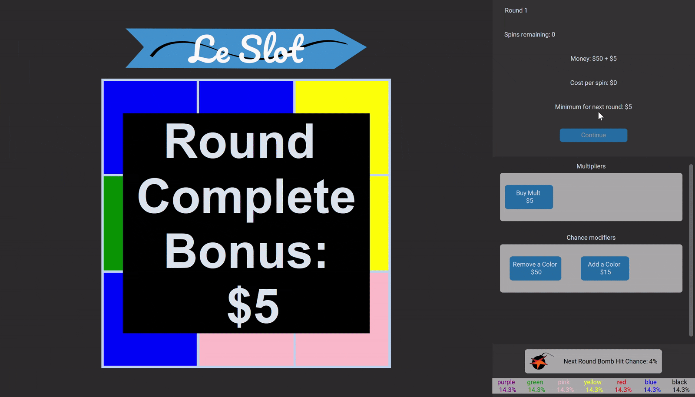

# Slots Game 🎰
***
A simple slot machine game where you upgrade your board to last as long as possible.

A fun personal project I worked on throughout my first semester of University, where I applied my newly learned Python skills to create something interesting.

## Gameplay 🎮
***
- Spin a slot machine to gain cash
- Spend the cash to upgrade your board through multiplier upgrades and probability modifiers
- Make enough money to not lose to the exponentially costlier spins

## Tools and Libraries 🛠️
***
- **Python**: The core programming language used for the project.
- **Tkinter/Customtkinter**: Library used to make the UI elements of the project, including animation of the slot. Customtkinter widgets were used to give the program a more modern look over the ugly default Tkinter widgets.
- **Pillow**: For loading and display images on the Customtkinter widgets.
- **Inkscape**: Used to create the vector graphics in the Images folder used in the program.

## Potential Future Improvements 🔮
***
If I were to revisit this project in the future, there are a few things that come to mind that would be valuable improvements:
- **Adopt an Object-Oriented Design**: Refactoring the application to use classes and objects would make the code more structured, reusable, and easier to extend. One immediate benefit would be that restarting the game state becomes as simple as creating a new game object.
- **Transition away from Tkinter:** While Tkinter was a great library for me to learn how to create a basic GUI, it has many limitations that has plagued my development. For example, Tkinter is not ideal for handling smooth animations, and I had to implement workarounds to reduce choppiness. There are also many small things, such as the inability to create transparent backgrounds on widgets that severely limit my creativity. Transitioning to a more advanced GUI library, such as **PyQt** or **Kivy** or even switching to **Pygame**, could provide more control over animations, design, and interactivity, leading to a more polished user experience.
- **More Interactivity**: There currently aren't many things you can buy in the shop, which can be improved by making more upgrades, or by adding more things to do in between rounds. This would be pretty trivial to implement.
